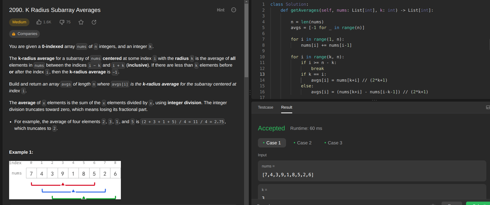
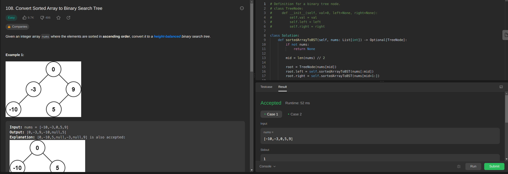

# DividirConquistar_Exercicios_Dupla4
Repositório  com exercícios do módulo de Dividir e Conquistar da disciplina de Projeto de Algoritmos.

**Número da Lista**: 4 
**Conteúdo da Disciplina**: Dividir e Conquistar 

## Alunos
| Matrícula | Aluno |
| -- | -- |
| 17/0107574  |  Laís Ramos Barbosa     |
| 21/1031833  | Taynara Cristina Ribeiro Marcellos  |

## Sobre 

Os enunciados dos 4 exercícios podem ser encontrados na listagem abaixo:

- [D. a-Good String](https://codeforces.com/problemset/problem/1385/D)
- [K Radius Subarray Averages](https://leetcode.com/problems/k-radius-subarray-averages/)
- [Convert Sorted Array to Binary Search Tree](https://leetcode.com/problems/convert-sorted-array-to-binary-search-tree/)
<!-- - 
-  -->

## Screenshots

Na figura 1, encontra-se a submissão aceita do exercício:

Figura 1 - .

Na figura 2, encontra-se a submissão aceita do exercício:  

Figura 2 - K Radius Subarray Averages.

Na figura 3, encontra-se a submissão aceita do exercício:

Figura 3 - Convert Sorted Array to Binary Search Tree.

<!-- Na figura 3, encontra-se a submissão aceita do exercício

Figura 3 - .

Na figura 4, :

Figura 4 - 
 -->

## Instalação 

**Linguagem**: e C++ 

### Instalação do Python

Para instalar  no **Windows**, siga o tutorial a seguir:
- [Python no Windows](https://www.python.org/downloads/windows/)

Para instalar  no **Linux**, siga o tutorial a seguir:
- [Python no Linux](https://python.org.br/instalacao-linux/)

### Instalação do C++

É necessário ter pré-instalados e configurados na sua máquina:
- [gcc](https://gcc.gnu.org/);

No **Linux**, para instalar o **g++**, execute o seguinte comando:

    sudo apt-get install build-essential

## Uso 

Após instalar as dependências do projeto, realize os seguintes comandos: 

    git clone https://github.com/projeto-de-algoritmos/DividirConquistar_G4
    cd DividirConquistar

### Uso dos exercícios em 

Agora o seu ambiente agora está configurado. Para testar os 2 exercícios desenvolvidos em , que estão nas pastas nomeados de:
- 
- 

Basta entrar na pasta do exercício e digitar os comandos:

   cd <nomePasta>
    python3 test1.py
    python3 test2.py
    
    

Pronto! O código está rodando e os exercícios podem ser testados.

### Uso dos exercícios em C++

Agora o seu ambiente agora está configurado. Entre na pasta no qual deseje testar um exercícios dentre os disponibilizidos. Basta entrar na pasta do exercício e digitar os comandos:

    cd <nomePasta>
    g++ <nomeArquivo>.cpp
    ./a.out < test1.txt
    ./a.out < test2.txt
    ./a.out < test3.txt

Pronto! O código está rodando e os exercícios podem ser testados.

## Vídeo

O vídeo explicando o algoritmo e o funcionamento dele, pode ser encontrado no link a seguir:
- [Vídeo]()

